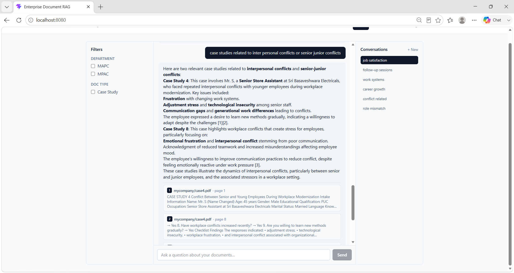
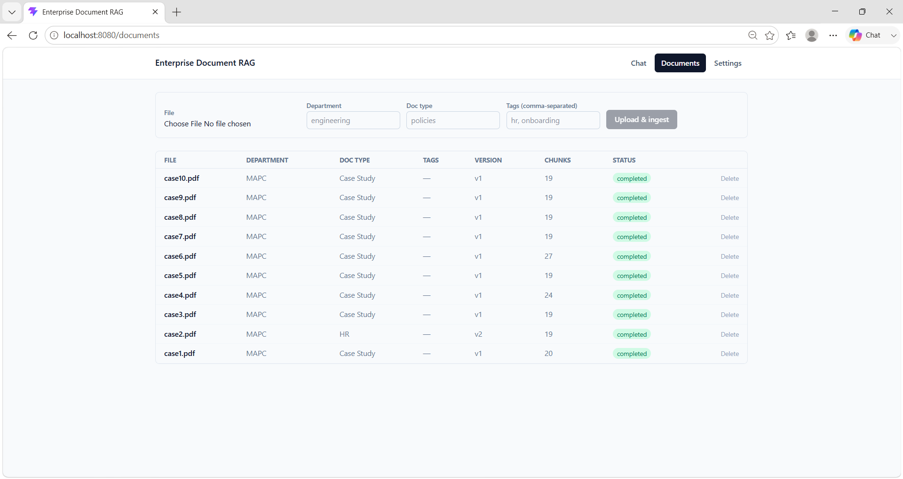
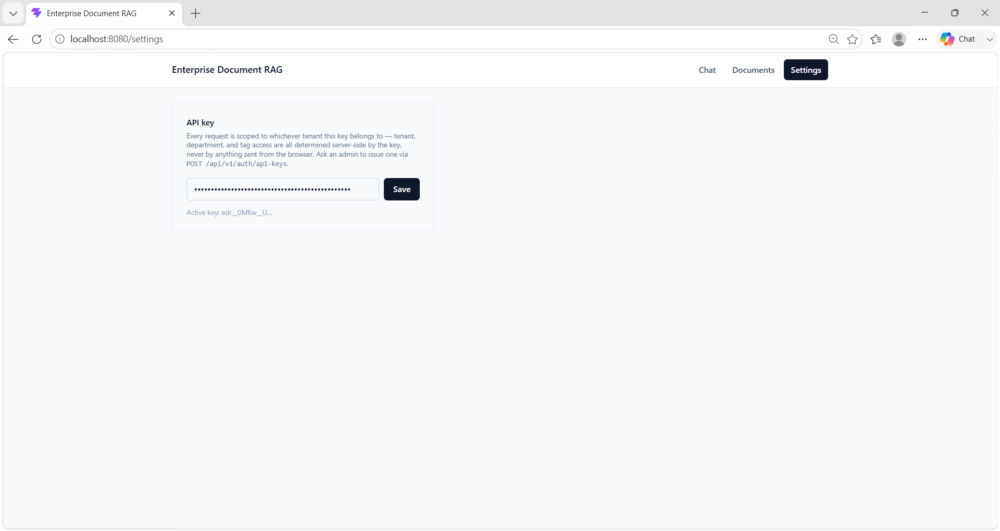
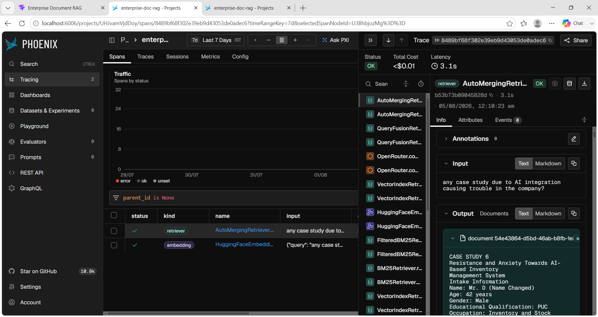
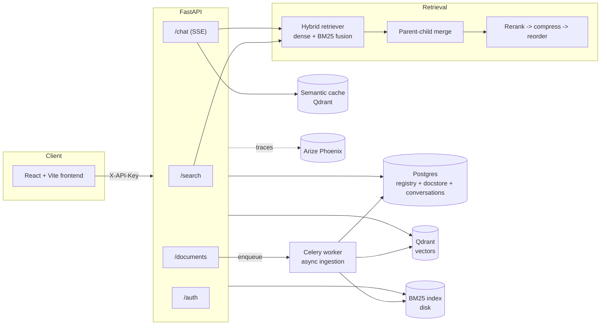

# 📚 Enterprise Document RAG

<p>
  
  
  
  
  
  
  
  
</p>

Production-grade, multi-tenant document RAG platform — not a ChatPDF clone. Built to
demonstrate the patterns real companies use for document Q&A at scale: hybrid search
(dense + BM25 fusion), parent-child chunking with reranking/query rewriting/context
compression, semantic answer caching, incremental indexing with document versioning,
streaming citations, multi-tenant API-key auth with metadata scoping, and
provider-agnostic LLM/embedding wiring (OpenAI, Anthropic, Gemini, Groq, OpenRouter).

📄 See [`docs/adr/`](docs/adr/) for key architecture decisions and
[`KNOWN_ISSUES.md`](KNOWN_ISSUES.md) for tracked defects and tuning decisions
(including root cause and fix, once resolved).

## 🖼️ Screenshots

| Chat with streaming citations (reranker on) | Document ingestion |
|---|---|
|  |  |

| API key generation | Phoenix tracing |
|---|---|
|  |  |

## ✨ Highlights

- 🔍 **Hybrid retrieval** — dense + BM25 fusion, parent-child chunk merging, rerank →
  compress → reorder pipeline
- 🏢 **Real multi-tenancy** — API-key scoped tenants with per-key metadata filters,
  never client-supplied tenant IDs
- ⚡ **Streaming everything** — SSE citations-then-answer, semantic answer caching in
  Qdrant, Redis-backed distributed rate limiting
- 🔄 **Incremental ingestion** — Celery-driven async pipeline with document
  versioning; re-ingesting only touches changed files
- 🔌 **Provider-agnostic** — swap LLM/embedding providers (OpenAI, Anthropic, Gemini,
  Groq, OpenRouter, local HuggingFace) via env vars, no code changes
- 📊 **Observability + eval built in** — OpenTelemetry tracing via Arize Phoenix,
  RAGAS-based faithfulness/precision/recall scoring
- 🧾 **Documented decisions** — every non-obvious architecture choice has an ADR with
  the tradeoffs considered

## 🏗️ Architecture



## 🧰 Stack

| Layer | Choice |
|---|---|
| Orchestration | LlamaIndex (hierarchical chunking, hybrid fusion, auto-merging retrieval) |
| Vector store | Qdrant |
| Registry / docstore / auth / conversations | Postgres |
| Async ingestion | Celery + Redis |
| Backend | FastAPI (async, SSE streaming) |
| Frontend | React + Vite + Tailwind CSS |
| Observability | Arize Phoenix (OpenTelemetry tracing) |
| Evaluation | RAGAS (faithfulness, context precision/recall, answer relevancy) |
| LLM providers | OpenAI, Anthropic, Gemini, Groq, OpenRouter — swap via `LLM_PROVIDER` |
| Embedding providers | OpenAI, Gemini, HuggingFace (local) — swap via `EMBEDDING_PROVIDER` |

## 🚀 Quick start (Docker Compose)

```bash
cp .env.example .env   # fill in at least one LLM_PROVIDER's API key
docker compose up --build
```

This brings up Postgres, Redis, Qdrant, Phoenix, the API, a Celery worker, and the
frontend (served at `http://localhost:8080`, proxying `/api` to the backend).
Apply database migrations once the `api` container is healthy:

```bash
docker compose exec api alembic upgrade head
```

Then seed a couple of demo API keys and ingest the sample corpus:

```bash
docker compose exec api python scripts/seed_api_keys.py
docker compose exec api python -m app.ingestion.runner /data/sample_docs
```

Paste one of the printed keys into the frontend's Settings page and start chatting.

## 🔐 Authentication

Every request is scoped to a tenant via an `X-API-Key` header — never by anything the
client sends directly (see `app/core/security/scoping.py`). Keys are managed through an
admin-gated endpoint using a separate shared secret (`ADMIN_BOOTSTRAP_API_KEY`):

```bash
curl -X POST http://localhost:8010/api/v1/auth/api-keys \
  -H "X-Admin-Key: $ADMIN_BOOTSTRAP_API_KEY" \
  -H "Content-Type: application/json" \
  -d '{"tenant_id": "acme", "name": "demo", "allowed_filters": {"department": ["engineering"]}}'
```

`allowed_filters` restricts which metadata facets a key may query — omitted facets are
unrestricted; a key can never see outside its own tenant regardless of what it requests.

### ⏱️ Rate limiting

`/chat` and `/search` are each rate-limited per API key (independent budgets — asking a
lot of questions doesn't exhaust your search quota or vice versa), backed by a
Redis fixed-window counter (`app/core/security/rate_limit.py`) so limits hold across
multiple API replicas, not just one process. Default: 30 requests/60s per key per
endpoint, configurable via `RATE_LIMIT_ENABLED` / `RATE_LIMIT_REQUESTS` /
`RATE_LIMIT_WINDOW_SECONDS`. Exceeding it returns `429` with a `Retry-After` header.

## 💻 Local development (without Docker)

### Backend

```bash
cd backend
py -3.12 -m venv .venv
./.venv/Scripts/pip install -r requirements.txt   # or requirements.lock.txt for exact reproducibility
./.venv/Scripts/pip install -e . --no-deps        # editable install, avoids CWD-relative imports
cp ../.env.example ../.env                        # fill in provider API keys
docker compose up -d postgres redis qdrant        # infra only
./.venv/Scripts/alembic upgrade head
./.venv/Scripts/uvicorn app.main:app --reload --port 8010
./.venv/Scripts/celery -A app.worker.celery_app worker --loglevel=info --pool=solo
```

> **Windows note:** `.env.example` points `DATABASE_URL`/`QDRANT_URL`/`REDIS_URL`/
> `PHOENIX_COLLECTOR_ENDPOINT` at `127.0.0.1`, not `localhost`. On Windows,
> resolving `localhost` tries IPv6 (`::1`) first and times out before falling
> back to IPv4, adding 5-20s to *every* new connection when running the API
> outside Docker against dockerized infra — see `KNOWN_ISSUES.md` #2. Keep
> `127.0.0.1` in these URLs for local dev.

### Frontend

```bash
cd frontend
npm install
npm run dev
```

### Ingesting documents

Two paths: folder-based CLI ingestion (bulk, synchronous) or the `/documents/upload`
API (single file, asynchronous via Celery — see the frontend's Documents page).

```bash
cd backend
./.venv/Scripts/python -m app.ingestion.runner ../sample_docs
```

Regenerate the bundled sample corpus (two tenants, mixed PDF/DOCX/PPTX) with:

```bash
python scripts/generate_sample_docs.py
```

## ✅ Testing

```bash
cd backend
./.venv/Scripts/pytest tests/unit -v          # fast, no external services
./.venv/Scripts/pytest tests/integration -v   # needs Postgres + Qdrant running
./.venv/Scripts/ruff check app tests eval
```

Generation-dependent behavior (real chat answers, RAGAS metric scoring) is tested with
`MockLLM`/local embeddings where possible; end-to-end verification needs a real
`LLM_PROVIDER` API key.

## 🔌 Ports

Host-side port mappings are intentionally non-default (see `.env.example`) to avoid
colliding with other services that may already be running locally: API `8010`,
frontend `8080`, Postgres `5435`, Redis `6380`, Qdrant `6335`/`6336`, Phoenix `6006`.
Only the host side differs — containers talk to each other over the standard ports
inside the Docker network.
